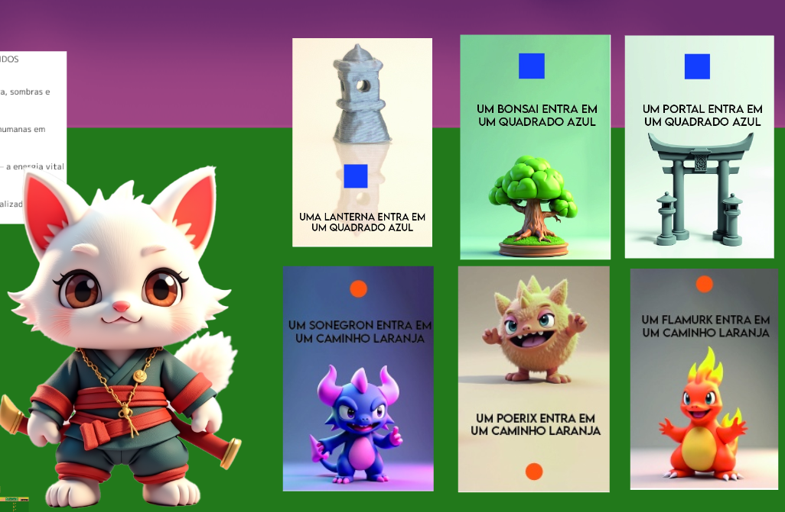

# Cats vs Demons

**Cats vs Demons** é um jogo 3D de ação e Tower Defense desenvolvido pela **QiP Games**.

Kin, um gato branco samurai, precisa proteger uma casa oriental contra ondas de demônios. As criaturas surgem no início dos caminhos e avançam continuamente até a casa. Kin combate os inimigos, recebe moedas por cada demônio derrotado e usa os recursos para comprar torres de defesa.



## Status

🧪 Pré-produção / protótipo digital em Unity.

## Loop principal

1. Demônios surgem nas entradas do mapa.
2. Eles percorrem os caminhos em direção à casa central.
3. Kin se movimenta pelo mapa e enfrenta os demônios.
4. Cada inimigo derrotado concede moedas.
5. As moedas são usadas para comprar torres de defesa.
6. A proximidade de Kin ativa ou potencializa o poder de cada torre.
7. Portais, bonsais e lanternas ajudam Kin a conter as ondas.
8. A partida termina se os demônios alcançarem e destruírem a casa.

## Mecânicas especiais

- **Torres:** compradas com moedas; cada tipo possui um poder quando Kin está próximo.
- **Portais:** transportam Kin para áreas próximas do portal atual ou de outros portais.
- **Bonsais:** recuperam a vida de Kin.
- **Lanternas:** reduzem a velocidade dos demônios próximos.

## Evolução do projeto

Cats vs Demons nasceu em **2016** como um projeto do curso Técnico em Programação de Jogos Digitais do **SENAI**, com uma primeira versão 2D programada em **Java**. O desenvolvimento já incluía GDD, Scrum, concept art, protótipos digitais e uma adaptação física de tabuleiro.


A versão atual retoma o conceito como Tower Defense 3D, com nova direção de arte e implementação em Unity 6.5. Este repositório documenta publicamente sua evolução como portfólio de game design e programação.

## Personagens

### Herói

- **Kin** — gato branco samurai controlado pelo jogador.

### Demônios

- **Sonegron** — associado ao sono.
- **Poerix** — associado à poeira.
- **Flamurk** — associado ao fogo.

## Tecnologia

- Unity **6.5 (6000.5.4f1)**
- Universal Render Pipeline (URP)
- C#
- NavMesh ou sistema de caminhos para movimentação dos inimigos
- ScriptableObjects para dados de inimigos, torres e ondas
- Arquitetura orientada a eventos
- Plataformas planejadas: PC e Android

## Estrutura planejada

```text
Assets/
└── _Project/
    ├── Art/
    ├── Audio/
    ├── Materials/
    ├── Prefabs/
    ├── Scenes/
    ├── ScriptableObjects/
    ├── Scripts/
    │   ├── Core/
    │   ├── Combat/
    │   ├── Economy/
    │   ├── Enemies/
    │   ├── Player/
    │   ├── Towers/
    │   ├── UI/
    │   └── Waves/
    └── Tests/
Packages/
ProjectSettings/
docs/
```

## Roadmap inicial

- [x] Definir versão da Unity
- [x] Definir o loop principal do Tower Defense
- [x] Definir câmera isométrica estática e composição da tela
- [ ] Criar projeto-base
- [ ] Montar o mapa com a casa oriental e os caminhos
- [ ] Implementar movimentação e combate de Kin
- [ ] Implementar demônios seguindo os caminhos
- [ ] Implementar vida e dano da casa
- [ ] Implementar ondas de inimigos
- [ ] Implementar moedas e compra de torres
- [ ] Implementar poderes das torres ativados por proximidade
- [ ] Implementar portais, bonsais e lanternas
- [ ] Criar protótipo local jogável
- [ ] Preparar builds para PC e Android

## Documentação

- [Game Design Document](docs/GDD.md)
- [Level design e layout da interface](docs/LEVEL_DESIGN.md)
- [Arquitetura técnica](docs/ARCHITECTURE.md)
- [Como contribuir](CONTRIBUTING.md)
- [Game Concept original no Prezi](https://prezi.com/view/dgeKHwZEjqjX1hIC55NR/?referral_token=8JTueZlnB3FN)

## Autoria

Projeto criado por **Ariel Kühn Quint** e desenvolvido pela **QiP Games**.

Todos os direitos reservados. Nenhuma licença de uso foi concedida neste repositório.
