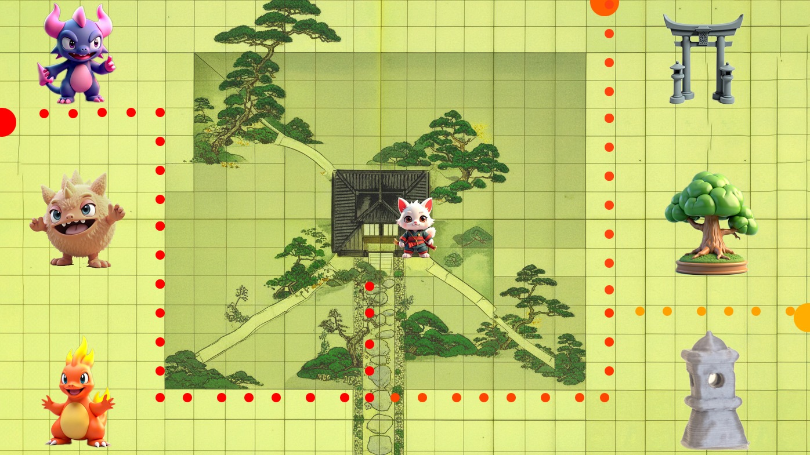
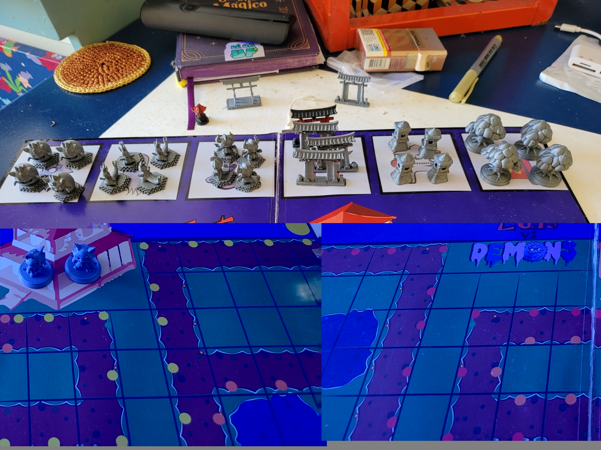

# Level Design — Tabuleiro Digital

## Direção

O cenário digital será uma interpretação 3D isométrica dos tabuleiros físicos. A câmera será estática e mostrará toda a área jogável durante a partida.

## Câmera

- Projeção **ortográfica** para aparência isométrica.
- Rotação inicial sugerida: **X 35°, Y 45°, Z 0°**.
- Câmera fixa durante a partida.
- Todo o tabuleiro, entradas, casa e pontos de construção permanecem visíveis.
- Sem objetos altos entre a câmera e Kin.
- Telhados, árvores e portais devem respeitar a leitura da silhueta das unidades.
- Ajuste automático de `orthographicSize` para diferentes proporções de tela.

## Composição da tela

Referência inicial para telas 16:9:

- **78% da largura:** tabuleiro e ação.
- **22% da largura à direita:** interface principal.
- **Faixa superior:** vida da casa, vida de Kin, moedas e onda atual.
- **Painel direito:** torres disponíveis, custo e informações.
- **Área inferior:** mensagens contextuais e habilidade selecionada.

A casa deve aparecer próxima ao centro visual da área jogável, não ao centro da tela inteira, pois a interface ocupa parte da lateral direita.

## Estrutura do mapa

### Núcleo

- Casa oriental como objetivo central.
- Área livre ao redor da casa para leitura do combate final.
- Kin começa próximo da casa.
- Destino final de todos os caminhos fica claramente marcado.

### Caminhos

- Rotas largas e visualmente diferentes do terreno.
- Bordas definidas com pedras, vegetação baixa ou diferença de material.
- Nenhum caminho pode ficar escondido atrás de construções ou árvores.
- As entradas dos demônios devem aparecer nas bordas superior, esquerda e inferior do tabuleiro.
- Os caminhos convergem progressivamente para a casa.
- Curvas amplas facilitam a leitura do fluxo e o posicionamento das torres.

### Pontos para torres

- Locais fixos, fora dos caminhos.
- Base circular ou hexagonal visível no terreno.
- Estado vazio, disponível, bloqueado ou ocupado.
- Distribuídos para permitir diferentes combinações de alcance.
- Nenhum ponto deve cobrir a entrada, a casa, um portal, bonsai ou lanterna.
- MVP sugerido: **6 pontos de torre**.

### Portais

- MVP sugerido: **2 portais** em lados opostos do mapa.
- Área segura para Kin aparecer ao redor de cada portal.
- Destino indicado antes da confirmação.
- Nunca transportar Kin para dentro de um caminho ocupado.

### Bonsais

- MVP sugerido: **2 bonsais**.
- Colocados longe o bastante da casa para exigir deslocamento.
- Área de cura claramente indicada.

### Lanternas

- MVP sugerido: **3 lanternas**.
- Posicionadas próximas a trechos importantes dos caminhos.
- Área de lentidão visível quando ativa.

## Legibilidade

- Caminho: cor e material próprios.
- Pontos de torre: bases com contorno.
- Portais: azul ou ciano.
- Cura do bonsai: verde.
- Lentidão da lanterna: azul-claro ou violeta.
- Entradas: aviso visual antes de cada onda.
- Alcance de torres e áreas de efeito aparecem apenas quando necessários.

## Primeiro greybox

Construir sem arte final usando primitivas:

1. Plano do terreno.
2. Cubo representando a casa.
3. Três caminhos.
4. Três entradas.
5. Seis pontos de torre.
6. Dois portais.
7. Dois bonsais.
8. Três lanternas.
9. Cápsula para Kin.
10. Cápsulas coloridas para os três demônios.

## Critérios de aprovação

O greybox está aprovado quando:

- Todo o mapa é visível em 16:9.
- A interface não cobre caminhos ou pontos de torre.
- Kin e todos os inimigos são identificáveis sem mover a câmera.
- Os três caminhos podem ser acompanhados simultaneamente.
- Os pontos de torre são reconhecidos sem abrir a loja.
- A casa permanece como foco visual do cenário.
